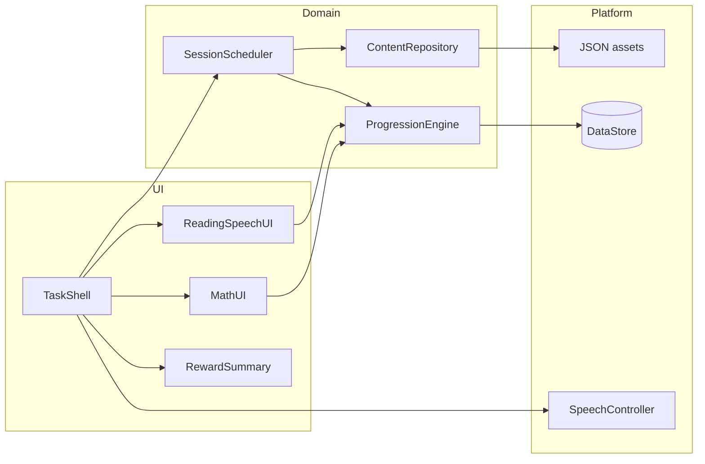

# ABC-Vorschul App - Plan

## Goal Capsule

- **Objective:** Ship a free, ad-free Android preschool app that mixes reading, speaking, and math exercises over a shared German content graph, with eye-friendly dark UI and soft feedback.
- **Product authority:** This Product Contract. Product name: ABC-Vorschul App.
- **Open blockers:** None.
- **Execution profile:** Greenfield Android (Kotlin + Jetpack Compose), offline content pack, local progress.

---

## Product Contract

### Summary

ABC-Vorschul App is a German-only Android learning app for individual children ages 4–7.
Sessions are a short mixed task loop (reading, speech, math) that reuse atomic content (word + image/emoji), offline after install.
Beginner mode scaffolds answers with drag-and-drop into silhouettes or puzzle shapes; Advanced removes scaffolds; multi-gap items resolve scaffolds per atom.
Speech items show a visible speak-aloud cue (unscored) then cloze/selection.
Progress tracks attempts and correct answers in parallel with the content graph, with a child-resistant parent ⋯ menu (Auto / Beginner / Advanced) and gentle auto-adjustment when Auto is active.

### Problem Frame

Many preschoolers already use phones for play.
Parents who want that time to build early literacy, speech, and number sense need a calm, offline-friendly experience without ads or pressure language.
Existing language apps often rely on wrong-answer distractors and English-first pedagogy; this product follows a Fibel-style syllable-to-word-to-sentence path and German plural/number practice with visual anchors.

### Key Decisions

- **Product name ABC-Vorschul App; repo `abc-vorschul-app`.** Display name may use spaces; filesystem slug is kebab-case.
- **Freeware, no ads, no monetization in identity.** `(session-settled: user-directed — chosen over commercial/freemium framing: meaningful phone use for the child)`
- **Android, dark-mode-only eye-friendly UI.** `(session-settled: user-directed — chosen over light/system themes: explicit eckdaten)`
- **German-only v1; localization later.** `(session-settled: user-directed — chosen over multi-language v1: confirmed at synthesis)`
- **No child profiles in v1.** `(session-settled: user-directed — chosen over multi-profile v1: confirmed at synthesis)`
- **Plan all three modules from the start; first shippable value is a mini content pack (not a path UI).** `(session-settled: user-directed — chosen over single-module MVP: plan everything; mini path as first value)`
- **Session UX is a simple task mix; no path/map screen.** `(session-settled: user-directed — chosen over guided path screen: "einfacher Mix… kein Pfad screen nötig")`
- **Content as reusable atoms in a content repository/graph** (e.g. Haus + image used across sentences and task types). `(session-settled: user-directed — chosen over duplicated per-exercise content: explicit content-repo requirement)`
- **Correct German capitalization from first words/sentences;** syllables building toward words prefer lowercase, composed words/sentences use normal orthography. `(session-settled: user-approved — chosen over all-caps-first curriculum: agent pedagogical recommendation accepted via "entscheide")`
- **Difficulty control is a three-state ⋯ menu (Auto / Beginner / Advanced) behind a lightweight parent gate;** when Beginner or Advanced is forced, auto pauses until Auto is selected again. `(session-settled: user-directed — chosen over auto-only or child-only control; doc-review clarified Auto as explicit state + parent gate)`
- **Auto may gently step down after a series of errors/hints/resolves.** `(session-settled: user-directed — chosen over only-up or per-element-only regression: option 2; doc-review: resolve counts as miss for downshift)`
- **Reading progress is per atomic word** (including words inside sentences); **math progress is by task difficulty / number-pair exposure.** `(session-settled: user-directed — chosen over one global level for all domains)`
- **Speech exercises included in the first mini content pack,** reusing the same atoms, with an unscored speak-aloud cue plus selection/cloze (no microphone scoring in v1). `(session-settled: user-directed — chosen over architecture-only or speaker-only embedding; doc-review clarified active spoken practice)`
- **No wrong distractors** in cloze/word-order; wrong drops/choices are simply incorrect placements, not fake competing answers. `(session-settled: user-directed — chosen over Duolingo-style distractor sets: explicit eckdaten)`
- **Writing/trace mode and custom family words deferred.** `(session-settled: user-directed — chosen over v1 inclusion: nice-to-have later)`
- **Default session is about five mixed tasks** with shared task-shell chrome, then a compact reward summary with Continue; after pack mastery, Continue uses spaced reinforcement of low-mastery items.
- **Parent progress dashboard deferred** — v1 keeps parent role to gate + difficulty only (Problem Frame trust comes from ad-free practice, not a stats screen).

### Actors

- A1. Child learner (primary) — ages 4–7; interacts with exercises, speaker button, rewards, speak-aloud cues.
- A2. Parent/caregiver — passes the parent gate, opens ⋯ menu for Auto/Beginner/Advanced; not a daily operator of content or progress reports in v1.
- A3. Content author (developer) — maintains the content repository/graph for packs; packs meet per-domain minimums for session scheduling.

### Key Flows

- F1. Mixed practice session
  - **Trigger:** Child opens the app / starts or resumes practice.
  - **Actors:** A1
  - **Steps:** App opens into the task-mix surface with persistent chrome: five-step session progress, optional running points tally, speaker control when TTS applies, and top-corner ⋯ entry. A default session draws about five tasks round-robin across reading/speech/math, avoiding immediate domain repeats. Reading draws respect Fibel readiness (syllable → word → dependent sentence for the same atoms) while Auto still varies Beginner/Advanced scaffolds per atom. Progress saves after each answer. Mid-session backgrounding resumes the in-progress session. System Back during an active task saves progress and opens the reward summary (or a gentle pause with Resume); Back from the summary exits to the launcher without clearing stored progress. After the fifth completed item, show a compact reward summary (session points total + brief encouragement) and Continue (another short session). Soft feedback, points, and subtle success animation/sound on correct answers before resolve.
  - **Outcome:** No path map; counters update on atoms/math skills; child can stop after any summary without penalty.
  - **Covered by:** R1, R2, R4, R8, R11, R12, R16, R17

- F2. Reading cloze / word order (Beginner)
  - **Trigger:** Reading task drawn for an atom or sentence using atoms.
  - **Actors:** A1
  - **Steps:** Show silhouette or puzzle slot(s); child drags or uses the non-drag alternative (tap piece, then tap slot); orthography follows Key Decision on casing; no wrong distractor tiles. Multi-gap sentences resolve scaffolding per atom slot from stored per-word state.
  - **Outcome:** Correct completes the item; incorrect yields gentle retry cue and counts as an attempt; resolve is available after repeated misses with the same scoring rules as math.
  - **Covered by:** R3, R4, R5, R8, R10, R13, R15

- F3. Reading cloze (Advanced)
  - **Trigger:** Same as F2 when Advanced applies for those atoms (and parent has not forced Beginner).
  - **Actors:** A1
  - **Steps:** Empty gaps only for Advanced atoms; Beginner atoms in the same sentence may still show scaffolds.
  - **Outcome:** Same soft feedback model as F2.
  - **Covered by:** R3, R5, R8, R9

- F4. Speech form challenge
  - **Trigger:** Speech task in the mix.
  - **Actors:** A1
  - **Steps:** App speaks a sentence in a challenging form (e.g. participle contrast); a visible non-blocking speak prompt (icon + short German label such as „Sprich mit!“) appears after TTS; tapping Continue / the prompt advances to cloze/selection without microphone capture; speaker can replay.
  - **Outcome:** Active spoken practice plus comprehension/selection over shared atoms.
  - **Covered by:** R6, R13

- F5. Math with visuals (Beginner)
  - **Trigger:** Math task in the mix when Beginner applies (or parent forced Beginner).
  - **Actors:** A1
  - **Steps:** Problem is spoken (arithmetic sentence not shown as reading text); speaker button available; visual/emoji quantities for singular/plural; child answers by dragging/tapping result visuals or the non-drag alternative; plural spelling may highlight differing letters; hard German plurals included in the pack.
  - **Outcome:** Correct awards points; near-miss and far-miss use different gentle hints; resolve reveals the answer, records resolved-not-correct (no points), counts as a miss toward auto-downgrade, does not count as mastery success for auto-ups, and advances after a brief reveal.
  - **Covered by:** R7, R9, R10, R13, R14

- F6. Math number entry (Advanced)
  - **Trigger:** Advanced math for harder items / larger results (and parent has not forced Beginner).
  - **Actors:** A1
  - **Steps:** Child types a natural-number result (0–100 as authored); operations stay within natural-number results. When German TTS is unavailable, show the arithmetic prompt as large numerals/symbols (not a reading challenge) so the item stays playable; alternatively the scheduler may serve Beginner visual mode for that draw on no-voice devices.
  - **Outcome:** Same hint/resolve model as F5.
  - **Covered by:** R7, R9, R10, R13, R14

- F7. Parent difficulty override
  - **Trigger:** Parent opens ⋯ and passes the lightweight parent gate.
  - **Actors:** A2, A1
  - **Steps:** After the gate, parent chooses Auto, Beginner, or Advanced. Forced Beginner/Advanced pauses auto until Auto is selected again; selecting Auto resumes adaptive progression from stored learner state. A change mid-task applies to the next task only.
  - **Outcome:** Predictable parental control; child cannot casually change the forced level.
  - **Covered by:** R9

### Requirements

**Platform and product shell**

- R1. The app runs on Android, presents dark-mode-only eye-friendly UI, and contains no ads or in-app purchases in v1.
- R2. v1 ships German content only and does not require child profiles; a single local progress store is enough.
- R17. After install, bundled mini-pack content and local progress read/write work without network; network is optional in v1.

**Content graph**

- R3. Learning content lives in a versioned content repository structured as reusable atoms (lemma/word + visual reference + metadata) that sentences and tasks reference, not copy. The first mini pack ships enough items per domain (at least three reading, three speech, and three math task templates, or an explicit documented backfill/repeat rule) so a five-task round-robin session without immediate domain repeats is always schedulable.
- R4. Reading progression builds Fibel-style from syllables to words to simple sentences (e.g. Ma → Mama / Oma → Mama ist im Haus), with correct capitalization at word/sentence level. Session reading draws must not serve a word or sentence task before the learner has been offered the prerequisite syllable/word introductions for its atoms in the mini pack (math/speech may interleave freely).

**Exercise mechanics**

- R5. Reading and speech tasks use cloze and/or word-order interactions without wrong distractor options; Beginner shows silhouette or puzzle-piece targets for drag-and-drop; Advanced shows empty gaps only; every drag-and-drop task also offers a tap-to-place alternative. Multi-gap reading/sentence tasks resolve Beginner vs Advanced scaffolding independently per atom slot from stored per-word learner state, not from a single task-level mode flag.
- R6. The first mini content pack includes speech items that reuse the same atoms and sometimes present challenging forms (e.g. participle contrasts), with system TTS playback; each speech item shows a visible non-blocking speak prompt after TTS and then unlocks selection/cloze; v1 does not evaluate spoken responses (no microphone permission).
- R7. Math tasks emphasize singular/plural with spoken prompts, visual quantities (emoji acceptable in v1), on-screen labels for the words, optional plural letter highlighting, Beginner visual answer selection, and Advanced numeric entry for larger results; natural-number results only, designed up to 100. When TTS is unavailable, Advanced math still presents a numeral/symbol prompt (or falls back to Beginner visual mode for that draw).

**Progression and feedback**

- R8. The app records attempts and correct answers alongside content atoms and math difficulty/number-pair exposure, and uses those counts for progressive evaluation and per-slot scaffold selection.
- R9. The ⋯ menu offers Auto, Beginner, and Advanced behind a lightweight parent gate (e.g. long-press or simple adult prompt, not an account). While Beginner or Advanced is forced, auto progression does not change level. Selecting Auto resumes adaptive progression from stored learner state. When Auto is active, frequent success raises help level toward Advanced; a series of errors, hints, or resolves gently steps back toward Beginner. Reading advances per atomic word (including words inside sentences); math advances by difficulty and number-combination exposure. First-time Auto defaults to Beginner scaffolds until evidence exists.
- R10. Feedback avoids harsh failure language; math hints vary by how close the answer is; items expose a resolve control (icon or ?) without instructional text on the button (math always; reading/speech after repeated misses). Using resolve reveals the correct answer briefly, records the item as resolved-not-correct, awards no points, counts as a miss toward auto-downgrade, does not count as a mastery success for auto-ups, and advances to the next item (no further retry on that item).
- R11. Correct answers award points and trigger child-friendly randomized success animations with subtle sounds (points only for correct completion before resolve).
- R12. Soft retry messaging stays encouraging ("try again" / "try another answer" class), never shaming.

**Media**

- R13. Spoken prompts use the device/system TTS when the app has no custom TTS engine; a speaker control replays the prompt (one playback at a time; stop prior speech on replay or task change). Math problem text is not shown as a reading challenge for the child when audio is available. Supported devices are those with a usable German system voice for prompts; when German TTS is unavailable, show a clear visual fallback (speaker disabled state plus labels/numeral prompts) so the child can still answer without audio.
- R14. Visual support uses images when available and emoji as the v1 fallback.

**Accessibility and session**

- R15. Interactive controls meet preschool-friendly touch targets; controls and feedback are labeled for assistive technologies; each drag-and-drop task provides a non-drag alternative; focus order follows the on-screen reading order of the exercise.
- R16. Default practice sessions are about five tasks balanced across reading, speech, and math (round-robin domains, avoid immediate domain repeats) with persistent task-shell chrome (session progress, optional points tally, speaker when applicable, ⋯). After five items, show a compact reward summary (session points + brief encouragement) and Continue. Continue starts another short session biased toward low-mastery / unresolved items once the mini pack has been fully introduced. Progress persists after every answer and when the app backgrounds; reopening resumes an unfinished session when one exists. System Back during an active task saves and opens the reward summary (or pause+Resume); Back from the summary exits without clearing progress.

### Acceptance Examples

- AE1. Covers R5 / F2. Given Beginner reading for atom "Mama", when the child opens the task, then silhouette or puzzle slots appear and only valid solution pieces are offered (no fake wrong words).
- AE2. Covers R5 / F3 / R8 / R9. Given Advanced auto-state for atom "Haus" and parent has not forced Beginner, when that atom appears in a sentence gap, then no silhouette/puzzle tip is shown for "Haus" even if another word in the sentence still uses Beginner help.
- AE3. Covers R9 / F7. Given parent forces Advanced via the gated ⋯ menu, when the child misses several items, then the app does not auto-downgrade until Auto is selected again; a child who only taps ⋯ without passing the gate cannot change the forced level.
- AE4. Covers R7 / F5. Given a beginner plural/addition visual task, when the prompt plays, then the arithmetic sentence is not displayed as reading text, a speaker control can replay it, and the child can answer by selecting/dragging the matching quantity of labeled items.
- AE5. Covers R10 / F5. Given a wrong math answer close to correct, when feedback shows, then the hint signals nearness; given a far miss, then the hint differs; after resolve, no points are awarded, the miss counts toward auto-downgrade when Auto is active, and the session advances.
- AE6. Covers R3 / R6. Given atom "Haus" with one visual, when it appears in a reading sentence and a speech item in the mini pack, then both reference the same atom and visual.
- AE7. Covers R6 / F4. Given a speech item, when it starts, then TTS plays the prompt, a visible „Sprich mit!“-style cue appears, and completing the selection/cloze succeeds without spoken-response scoring.
- AE8. Covers R9 / F7. Given the parent gate, when Auto is selected after a forced Advanced setting, then adaptive progression resumes from stored learner state on subsequent tasks.
- AE9. Covers R16 / F1. Given an unfinished session of three completed tasks, when the child reopens the app, then practice resumes at the next task rather than silently starting a brand-new five-task session.
- AE10. Covers R4 / R16. Given atoms whose syllable intro has not yet been offered, when the session draws reading tasks, then it does not serve a dependent sentence task for those atoms first.
- AE11. Covers R7 / R13 / F6. Given Advanced math with German TTS unavailable, when the task opens, then a numeral/symbol prompt (or Beginner visual fallback) is shown so the child can still answer.
- AE12. Covers R17. Given airplane mode after install, when the child opens practice, then mini-pack tasks and progress save still work.

### Success Criteria

- A child can complete a short mixed session from the mini pack without leaving the task-mix surface.
- Parent can open the gated ⋯ control and set Auto/Beginner/Advanced in a small number of steps (gate + selection).
- Content authors can add a new atom once and reuse it in multiple task types without duplicating media.
- No ads, no account wall, and no profile picker appear in v1.
- Speech items include a visible unscored speak-aloud cue in addition to selection/cloze.
- Core practice works offline after install.

### Scope Boundaries

**In scope for planning/implementation of v1**

- Android app shell (Kotlin + Jetpack Compose assumed)
- Content repository/graph + mini pack (reading, speech, math) meeting session-scheduling minimums
- Task-mix session, Beginner/Advanced/Auto mechanics, progress store, rewards, system TTS, emoji/image visuals
- Parent gate, accessibility baseline, resolve/session lifecycle, offline local practice, Fibel draw order, per-slot scaffolding

**Deferred for later**

- Writing/trace mode with stroke direction
- Custom family names/words
- Localization beyond German
- Child profiles / multi-child switching
- Path/map/campaign screens
- Custom recorded voice packs (beyond system TTS)
- Full illustrated asset pipeline beyond emoji/simple images
- Microphone-based pronunciation scoring / speech recognition
- Parent progress / mastery dashboard (v1 parent role is gate + difficulty only)

**Outside this product's identity**

- Ad-supported or paywalled learning
- Competitive multiplayer / social feeds
- English-first curriculum disguised as German add-on

### Dependencies / Assumptions

- Supported devices provide a usable German system TTS voice for spoken prompts; pre-release validation includes an offline TTS smoke check on target devices. When TTS is missing, R13/R7 fallbacks apply.
- Emoji rendering on Android is sufficient visual scaffolding until custom art exists.
- Kotlin + Jetpack Compose is the default implementation stack.

### Outstanding Questions

**Deferred (non-blocking)**

- Exact auto-progression numeric thresholds may be tuned after playtests; defaults are recorded under Assumptions.
- Puzzle-piece Beginner variant beyond the silhouette default.

**Blocking**

- None.

### Sources / Research

- Product brainstorm dialogue (2026-07-26) establishing Fibel pedagogy, no distractors, content atoms, progression rules, and session-mix UX.
- Document review rounds 1–2 (2026-07-26) clarifying interaction, progression, offline, and session lifecycle behavior.
- External Android research (2026): Compose single-activity + custom drag gestures preferred over system DnD; `TextToSpeech` with German offline voice checks; versioned JSON in `assets/` + DataStore for progress; Room deferred until query complexity warrants it.

---

## Planning Contract

### Product Contract preservation

Product Contract unchanged in substance during enrichment. Outstanding planning forks were resolved into Key Technical Decisions and Assumptions below (content format, parent-gate gesture, silhouette default, Advanced-math TTS-out path, initial auto thresholds).

### Summary

Greenfield Compose app: load a versioned JSON content graph, run five-task mixed sessions with Fibel-aware scheduling, render reading/speech/math exercises with per-atom scaffolds, persist learner state in DataStore, and speak prompts via system TTS with visual fallbacks.

### Key Technical Decisions

- KTD1. **Kotlin + Jetpack Compose, single `ComponentActivity`, Compose BOM (current stable at scaffold time), minSdk 26.** Matches product assumptions and preschool touch APIs; no multi-activity shell.
- KTD2. **Screen navigation via a small sealed `AppScreen` state in a session-scoped ViewModel** (Practice, RewardSummary, optional Pause). Chosen over Navigation 3 for a two-screen shell — revisit if screens proliferate.
- KTD3. **Curriculum as versioned JSON under `app/src/main/assets/content/`** with atoms, sentences, and task templates referencing atom IDs. Chosen over YAML (no built-in parser) and over Room for a static mini pack. `(inherits content-atoms product decision)`
- KTD4. **Learner progress and parent difficulty mode in DataStore Preferences** (and optionally proto later). Persist after every answer; no backend.
- KTD5. **Custom Compose drag (`detectDragGestures`) + tap-to-place**, not platform drag-and-drop / `ClipData`. Forgiving hit targets; snap-back on miss.
- KTD6. **`SpeechController` wrapping `TextToSpeech`**, activity/application scoped, released on destroy; prefer offline German voice; declare TTS `<queries>`; stop on task change.
- KTD7. **Parent gate = long-press (~1.5s) on the ⋯ control**, then Auto/Beginner/Advanced sheet. Chosen over PIN/account for v1.
- KTD8. **Beginner scaffold default = silhouette slots**; puzzle pieces deferred as a content/UI variant flag later.
- KTD9. **Advanced-math TTS-out = large numeral/symbol prompt** (not reading prose); do not silently rewrite the whole session to Beginner unless entry was Advanced-only and numerals are insufficient.
- KTD10. **Initial Auto thresholds (tunable):** per reading atom, 3 consecutive correct → Advanced scaffold for that atom; 3 consecutive miss/hint/resolve → Beginner. Math uses analogous streak on difficulty band / number-pair keys. Forced parent mode ignores auto until Auto selected. `(session-settled inheritance: soft step-down + parent override wins)`
- KTD11. **Hilt not required for v1** — constructor/manual composition of repositories into ViewModels; add DI only if wiring pain appears.
- KTD12. **Unit tests for content validation, scheduler, and progression pure logic; instrumented/Compose UI tests for drag commit and parent gate later as capacity allows.** Smoke: install + one offline session on an emulator with German TTS locale.

### High-Level Technical Design



Content atoms fan out to many tasks; progress keys are atom IDs (reading) and math skill keys (operation + operand band).

### Assumptions

- Emulator/device used for verification can install a German TTS voice or exercises the numeral/visual fallbacks.
- Mini pack authored in-repo ships ≥3 task templates per domain at first content commit.
- Dark theme tokens are app-forced (`uiMode` night) rather than following system light mode.
- Sound effects are short bundled assets (or system defaults); no network audio.

### Alternative Approaches Considered

- **Navigation 3 everywhere** — deferred; two primary screens do not justify the compileSdk/navigation surface yet.
- **Room-backed content** — deferred until packs need indexed queries or partial updates.
- **System drag-and-drop APIs** — rejected for preschool tile placement (long-press + ClipData friction).

### Risks & Dependencies

- German TTS quality/availability varies by OEM — mitigated by R13/R7 fallbacks and smoke check.
- Per-slot scaffold state in sentences increases UI complexity — covered by dedicated unit tests on progression + UI state mapping.
- Drag accessibility — tap-to-place is mandatory (R15), not optional polish.

---

## Output Structure

```text
app/
  src/main/
    AndroidManifest.xml
    assets/content/
      pack.manifest.json
      atoms.json
      sentences.json
      tasks.json
    java/.../abc/
      MainActivity.kt
      AbcApp.kt
      ui/shell/...
      ui/exercise/...
      ui/theme/...
      content/...
      progress/...
      session/...
      speech/...
    res/...
  src/test/java/.../
  src/androidTest/java/.../
docs/plans/2026-07-26-001-feat-abc-vorschul-app-plan.md
```

---

## Implementation Units

### U1. Android Compose project scaffold

- **Goal:** Create a runnable dark-only Compose app shell named ABC-Vorschul App with the package layout above.
- **Requirements:** R1, R2
- **Dependencies:** None
- **Files:**
  - create: `settings.gradle.kts`, `build.gradle.kts`, `gradle/libs.versions.toml`, `app/build.gradle.kts`
  - create: `app/src/main/AndroidManifest.xml`, `app/src/main/java/.../MainActivity.kt`, `app/src/main/java/.../ui/theme/Theme.kt`
  - create: `README.md`
- **Approach:** Single activity; force dark theme; application label "ABC-Vorschul App"; no ads SDKs; placeholder home that will host Practice in U4.
- **Execution note:** Prefer install/runtime smoke on emulator over heavy unit coverage for this scaffolding unit.
- **Test scenarios:**
  - Happy path: app launches to a visible Compose root without crash.
  - Edge: configuration change (rotate) does not crash the empty shell.
- **Verification:** `./gradlew :app:assembleDebug` succeeds; app installs and shows dark root.

### U2. Content graph schema, mini pack, and loader

- **Goal:** Ship versioned JSON content with atoms/sentences/tasks and a validated in-memory repository.
- **Requirements:** R3, R4, R6, R7, R14, AE6, AE10
- **Dependencies:** U1
- **Files:**
  - create: `app/src/main/assets/content/pack.manifest.json`, `atoms.json`, `sentences.json`, `tasks.json`
  - create: `app/src/main/java/.../content/ContentModels.kt`, `ContentRepository.kt`, `ContentValidator.kt`
  - create: `app/src/test/java/.../content/ContentValidatorTest.kt`, `ContentRepositoryTest.kt`
- **Approach:** Stable string IDs; tasks reference atom IDs; manifest carries `schemaVersion` and pack id; validator checks unique IDs, dangling refs, and ≥3 templates per domain. Mini pack includes Fibel chain (e.g. ma → Mama/Oma → Mama ist im Haus), hard plurals, and speech items reusing atoms.
- **Patterns to follow:** Pure Kotlin domain models; parse with kotlinx.serialization.
- **Test scenarios:**
  - Happy path: valid pack loads and resolves atom→visual for a sentence and a speech task (AE6).
  - Error: missing atom ref fails validation with a clear error.
  - Edge: pack below domain minimum fails validation.
  - Covers AE10: content marks syllable prerequisites so scheduler can enforce order (fields present even if scheduler lands in U4).
- **Verification:** Unit tests green; sample pack present in assets.

### U3. Progress store and progression engine

- **Goal:** Persist attempts/correct/resolves, parent mode, points, and compute per-atom / math-key scaffold levels.
- **Requirements:** R8, R9, R10, R11, AE2, AE3, AE5, AE8
- **Dependencies:** U1
- **Files:**
  - create: `app/src/main/java/.../progress/ProgressModels.kt`, `ProgressRepository.kt`, `ProgressionEngine.kt`
  - create: `app/src/test/java/.../progress/ProgressionEngineTest.kt`
- **Approach:** DataStore holds parent mode (`Auto|Beginner|Advanced`), per-atom stats, math-key stats, points, unfinished session snapshot. Engine applies KTD10 streaks; forced parent mode freezes auto. Resolve increments miss streak for downshifts but not mastery success.
- **Test scenarios:**
  - Covers AE2: after atom Haus reaches Advanced, `scaffoldFor(atom)` is Advanced while another atom stays Beginner.
  - Covers AE3: parent Advanced freezes auto despite miss streak.
  - Covers AE8: switching back to Auto resumes from stored stats.
  - Covers AE5: resolve does not award mastery success; counts toward downshift when Auto.
  - Edge: first-time Auto defaults Beginner scaffolds.
- **Verification:** ProgressionEngine tests cover up/down/freeze; ProgressRepository round-trip under JVM DataStore test or fake.

### U4. Session scheduler and task shell

- **Goal:** Build five-task sessions with Fibel-aware draws, chrome, resume, Back behavior, reward summary, and parent gate.
- **Requirements:** R4, R9, R15, R16, R17, F1, F7, AE3, AE8, AE9, AE10, AE12
- **Dependencies:** U2, U3
- **Files:**
  - create: `app/src/main/java/.../session/SessionScheduler.kt`, `SessionViewModel.kt`, `SessionModels.kt`
  - create: `app/src/main/java/.../ui/shell/TaskShell.kt`, `RewardSummaryScreen.kt`, `ParentGate.kt`, `DifficultySheet.kt`
  - create: `app/src/test/java/.../session/SessionSchedulerTest.kt`
- **Approach:** Scheduler round-robins domains, avoids immediate domain repeats, enforces reading prerequisites, biases Continue toward low mastery after pack intro. Shell shows progress 1–5, points, speaker slot, ⋯. Long-press ⋯ opens difficulty sheet. Back → summary/pause per R16. Wire placeholder exercise host until U5/U6.
- **Test scenarios:**
  - Covers AE10: sentence task not drawn before syllable/word intros.
  - Covers AE9: unfinished session restores next index.
  - Happy path: five draws span all three domains when pack allows.
  - Edge: Continue after pack intro prefers low-mastery ids.
- **Verification:** Scheduler unit tests; manual smoke of chrome + long-press gate on emulator.

### U5. Speech controller and speaker UX

- **Goal:** Reliable German TTS playback with stop/replay and unavailable fallback signaling.
- **Requirements:** R13, R6, AE7, AE11
- **Dependencies:** U1, U4
- **Files:**
  - create: `app/src/main/java/.../speech/SpeechController.kt`
  - create: `app/src/main/java/.../ui/shell/SpeakerButton.kt`
  - modify: `app/src/main/AndroidManifest.xml` (TTS queries)
- **Approach:** Async init; select offline German voice when present; expose `speak`, `stop`, `isAvailable`; UI disables speaker and relies on visual prompts when unavailable.
- **Test scenarios:**
  - Happy path: speak queues one utterance; replay stops prior speech.
  - Edge: `isAvailable=false` disables speaker affordance.
- **Verification:** Manual TTS smoke on emulator/device; unit test a fake controller integration with shell state if helpful.

### U6. Reading and speech exercise UI

- **Goal:** Implement cloze/word-order with per-slot scaffolds, drag + tap-to-place, speak-aloud cue, soft feedback, and resolve-after-misses.
- **Requirements:** R5, R6, R10, R12, R15, F2–F4, AE1, AE2, AE7
- **Dependencies:** U4, U5, U3
- **Files:**
  - create: `app/src/main/java/.../ui/exercise/ReadingExercise.kt`, `SpeechExercise.kt`, `DragSlotBoard.kt`, `SpeakAloudCue.kt`
  - create: `app/src/test/java/.../ui/exercise/ScaffoldMappingTest.kt`
  - create: `app/src/androidTest/java/.../exercise/ReadingInteractionTest.kt` (optional if time)
- **Approach:** Map each gap to atom scaffold from ProgressionEngine; only solution tiles; silhouette default; speak cue then unlock interaction for speech; record attempts into ProgressRepository.
- **Execution note:** Prefer logic tests for scaffold mapping first; UI tests for drag commit if tooling is ready.
- **Test scenarios:**
  - Covers AE1: Beginner shows silhouette; no distractor tiles.
  - Covers AE2: mixed scaffolds in one sentence.
  - Covers AE7: speak cue visible before cloze unlocks.
  - Error: wrong drop snaps back and increments attempt without points.
- **Verification:** Mapping tests green; manual pass of one Beginner and one Advanced reading item plus one speech item.

### U7. Math exercise UI

- **Goal:** Beginner visual quantity answers and Advanced numeric entry with near/far hints, resolve, and TTS-out numeral prompt.
- **Requirements:** R7, R10, R13, F5, F6, AE4, AE5, AE11
- **Dependencies:** U4, U5, U3
- **Files:**
  - create: `app/src/main/java/.../ui/exercise/MathExercise.kt`, `VisualQuantityBoard.kt`, `NumberPad.kt`
  - create: `app/src/test/java/.../ui/exercise/MathHintingTest.kt`
- **Approach:** Near = absolute distance 1–2 unless content overrides; resolve uses shared R10 semantics; forced Beginner blocks F6 numeric entry.
- **Test scenarios:**
  - Covers AE4: no arithmetic reading text when audio path used; visual answer works.
  - Covers AE5: near vs far hint strings/keys differ; resolve awards no points.
  - Covers AE11: TTS unavailable shows numeral/symbol prompt.
  - Edge: parent forced Beginner never shows number pad for large results.
- **Verification:** Hinting unit tests; manual math Beginner + Advanced + TTS-off path.

### U8. Rewards, sounds, and end-to-end session glue

- **Goal:** Points animations/sounds on correct answers; polish summary Continue loop; wire all exercise types into the scheduler end-to-end.
- **Requirements:** R11, R12, R16, R17, F1, AE9, AE12
- **Dependencies:** U6, U7
- **Files:**
  - create: `app/src/main/java/.../ui/rewards/SuccessEffects.kt`
  - create: `app/src/main/res/raw/` (short success sounds)
  - modify: `SessionViewModel.kt`, exercise hosts
  - create: `app/src/androidTest/java/.../session/OfflineSessionSmokeTest.kt` (or documented manual script in README)
- **Approach:** Randomized lightweight success effects; no points on resolve; ensure airplane-mode session works with bundled content.
- **Execution note:** Smoke-first verification for the full loop.
- **Test scenarios:**
  - Happy path: five-task session awards points only on pre-resolve corrects and reaches summary.
  - Covers AE12: airplane mode still completes a task and persists progress.
  - Covers AE9: kill/reopen mid-session resumes.
- **Verification:** Manual offline session script checked off in README; assembleDebug + unit test suite green.

---

## Verification Contract

- **Unit:** `./gradlew :app:testDebugUnitTest` — content validation, progression, scheduler, hinting, scaffold mapping.
- **Build:** `./gradlew :app:assembleDebug`
- **Manual / smoke:** Emulator or device with German locale/TTS (or exercise fallbacks): install, airplane mode, complete one five-task session including reading+speech+math, long-press parent gate, force Beginner, verify mixed scaffolds in a sentence, resolve one math item, background/resume mid-session.
- **Quality gates:** No network permission required for core practice; no ad libraries in Gradle deps; dark theme forced.

---

## Definition of Done

- All units U1–U8 complete with their verification outcomes met.
- Product requirements R1–R17 that affect v1 behavior are covered by a unit and/or acceptance example.
- Mini pack validates and schedules balanced sessions.
- README documents how to run tests and the offline smoke script.
- No blocking open questions remain.
